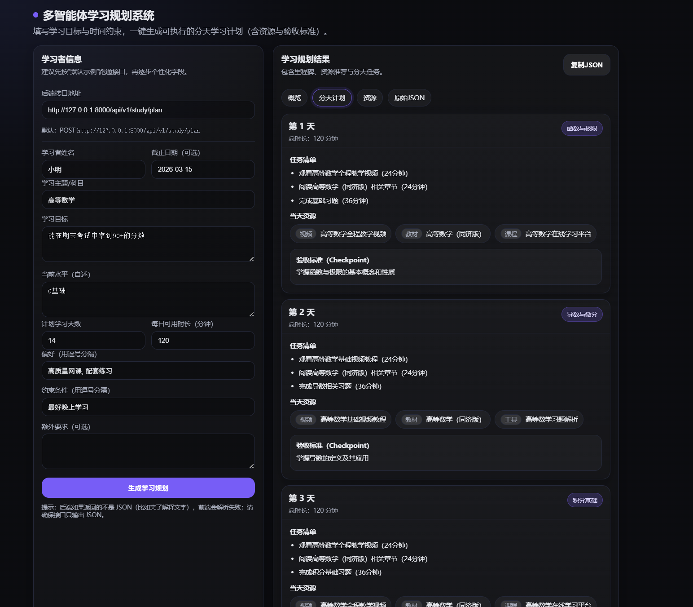
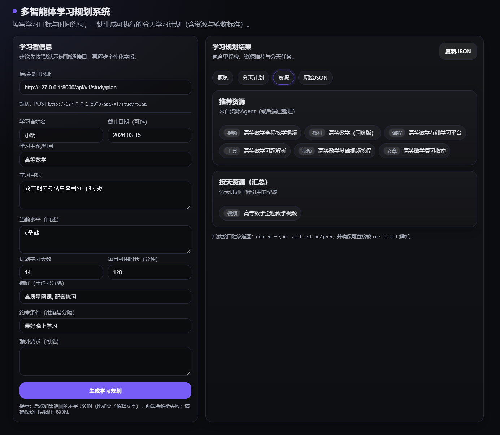

# 学习规划多Agent系统 (Study Planner Multi-Agent System)

## 介绍

这是一个基于多Agent的学习规划系统。系统由四个主要组件构成：

1. **学情诊断Agent**：通过分析输入信息，诊断学习者的当前水平、薄弱点、知识结构缺口和优先级。
2. **资源Agent**：根据学习主题、目标和诊断结果，搜索并推荐高质量的学习资源。
3. **时间规划Agent**：根据学习者的可用时间、学习天数、截止日期等约束条件，提供个性化的学习时间安排建议。
4. **学习规划Agent**：综合学情诊断、资源推荐和时间规划建议，为学习者输出严格的学习规划。

## 系统要求

* Python 3.10 或更高版本
* 依赖库：`uvicorn`、`fastapi`、`openai`、`requests`、`python-dotenv` 等

## 快速开始

### 1. 安装依赖

首先，确保你已经安装了 Python 3.10 或更高版本。然后，创建并激活一个虚拟环境并安装依赖：

```bash
# 创建并激活虚拟环境
conda create -n your_env_name python=3.10
conda activate your_env_name

# 安装依赖
pip install -r requirements.txt
```

### 2. 配置环境变量

复制示例环境配置文件并填写你的 OpenAI API 密钥。

```bash
cp example.env .env
```

编辑 `.env` 文件，填写你的 OpenAI API 密钥：

```env
OPENAI_API_KEY=your_openai_api_key_here
```

### 3. 运行系统

启动 FastAPI 服务：

```bash
uvicorn trip_planner.main:app --reload --host 0.0.0.0 --port 8000
```

### 4. 访问系统

使用 VSCode 或其他支持 Live Server 的编辑器来运行 `index.html` 文件，查看系统页面。

---

## 运行图片





---

## 目录结构

```bash
.
├── assets/                    # 运行图片和系统架构图
├── study/                     # FastAPI 应用源码
│   ├── main.py                # FastAPI 主入口
│   ├── my_llm.py              # LLM 模型相关代码
│   ├── prompts.py             # Prompt 管理
│   ├── schemas.py             # 数据模型（用于请求和响应）
│   ├── study_planner_agent.py # 学习规划Agent 相关代码
│   ├── config.py              # 配置文件
│   ├── index.html             # 系统前端页面
│   └── ...
├── example.env                # 示例环境变量文件
├── requirements.txt           # 依赖列表
└── README.md               

```

## 贡献

欢迎提出问题和提交 Pull Requests。我们欢迎大家为这个系统做出贡献，提升其功能与稳定性。

---

## 提示

* 请确保你已经正确配置 OpenAI API 密钥，以避免运行时出错。

---
